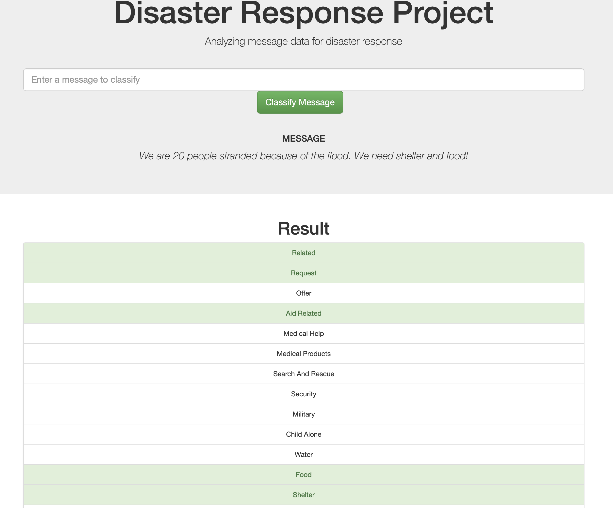
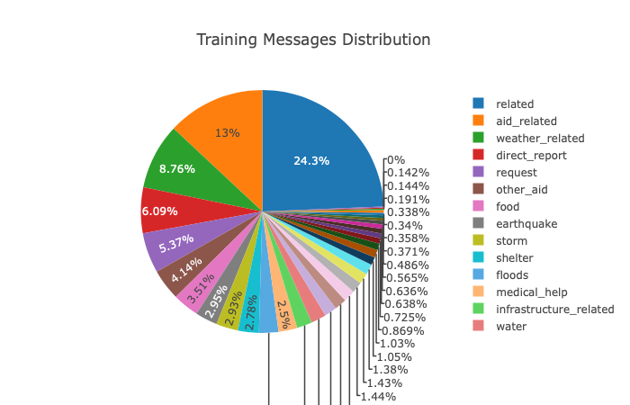

# Disaster Response Messages - Multi-class classifier

Prepare, analyze and visualize disaster data provided by figure8 to build a Machine Learning model that classifies disaster messages based on their content. 

This project was developed as part of Udacity Data Science Nanodegree.

To classify a message, the user can input text in the text-input slot and then press __Classify Message__. The classes that are assigned as most appropriate to the message will be highlighted in green.

## Installation Requirements

The project uses scikit-learn and nltk with Python 3.*. A way to install the two packages locally can be to run the following commands:

`conda install -c intel scikit-lean`

`conda install -c anaconda nltk`

## Data
The data (and code) can be accessed within the repository in the app/data. The two csv files were provided by figure8 in partnership with Udacity for the Data Science Nanodegree.
The overview of the used data can be seen in the bellow chart:

## Running the App

* Run the following commands in the project's root directory to set up a new database and model.

    * To run ETL pipeline that cleans data and stores in database:

        `python data/process_data.py data/disaster_messages.csv data/disaster_categories.csv data/DisasterResponse.db`

    * To run ML pipeline that trains classifier and saves it (a trained model is not available due to repository upload limitations):

        `python models/train_classifier.py data/DisasterResponse.db models/classifier.pkl` 

* Run the following command in the app's directory to run your web app. 
    `python run.py`

* Go to http://0.0.0.0:3001/

## Licensing, Authors, Acknowledgements

Must give credit to Figure Eight for the data. Feel free to use the code provided here as you would like!
